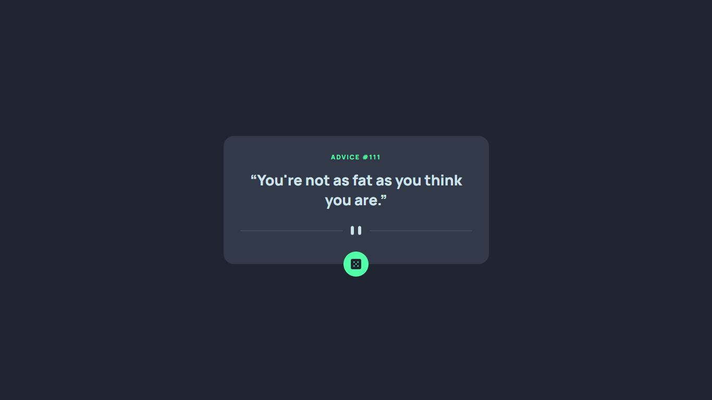

# Frontend Mentor - Advice generator app solution

This is a solution to the [Advice generator app challenge on Frontend Mentor](https://www.frontendmentor.io/challenges/advice-generator-app-QdUG-13db). Frontend Mentor challenges help you improve your coding skills by building realistic projects.

## Table of contents

- [Overview](#overview)
  - [The challenge](#the-challenge)
  - [Screenshot](#screenshot)
  - [Links](#links)
- [My process](#my-process)
  - [Built with](#built-with)
- [Author](#author)

## Overview

The Advice Generator App challenge on Frontend Mentor is a great project for those learning how to interact with third-party APIs. Here’s an overview

### The challenge

Users should be able to:

- View the optimal layout for the app depending on their device's screen size
- See hover states for all interactive elements on the page
- Generate a new piece of advice by clicking the dice icon

### Screenshot



### Links

- Solution URL: [Add solution URL here](https://your-solution-url.com)
- Live Site URL: [Add live site URL here](https://your-live-site-url.com)

## My process

1. **Structured the HTML and Defined Classes Using BEM Naming**:
   - I organized the HTML structure by creating necessary elements for the advice generator app.
   - I followed the **BEM (Block, Element, Modifier)** naming convention to define classes.
   - I also included the link to the **Google Fonts** stylesheet in the HTML to apply custom fonts.

2. **Created the CSS File and Styled Elements with Color Variables**:
   - I generated a CSS file (e.g., `styles.css`) and linked it to the HTML.
   - I applied styles to various elements, utilizing variables for colors to maintain consistency. For example:
     ```css
     :root {
      --light-cyan: hsl(193, 38%, 86%);
      --neon-green: hsl(150, 100%, 66%);

      --grayish-blue: hsl(217, 19%, 38%);
      --dark-grayish-blue: hsl(217, 19%, 24%);
      --dark-blue: hsl(218, 23%, 16%);
     }
     ```

3. **Implemented JavaScript Function for API Retrieval**:
   - I created a JavaScript file (e.g., `index.js`) and linked it to the HTML.
   - I wrote a function that performs a **GET request** to the **Advice Slip API**.
   - The function handles the API response and updates the quote and author elements in the app. For example:
     ```javascript
     fetch('	https://api.adviceslip.com/advice')
      .then((body) => body.json())
      .then(({ slip }) => {
        id.innerText = slip.id;
        text.innerText = slip.advice;
      })
      .catch((error) => console.error(error));
     ```

### Built with

- BEM CSS
- CSS custom properties
- Flexbox
- JS
- Advice Slip JSON API

## Author

- Frontend Mentor - [@lucasbsand](https://www.frontendmentor.io/profile/lucasbsand)

